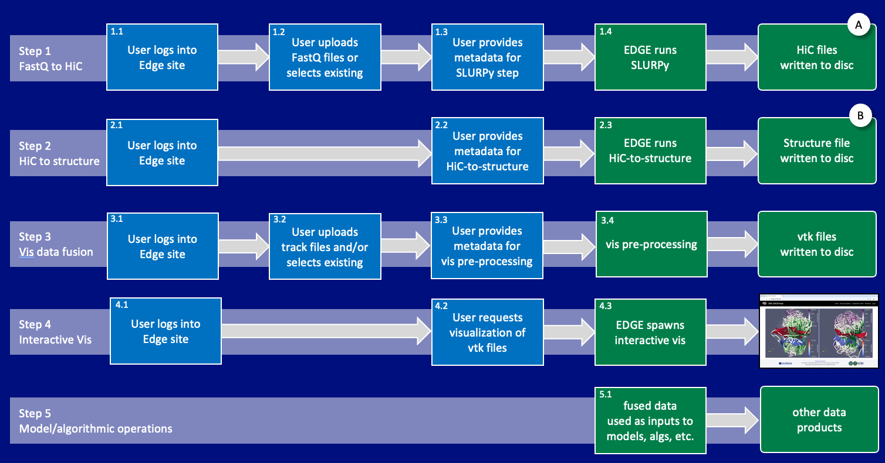

# EPIC Workflow
<!--
||
| ---- |
|*Diagram of the EPIC workflow*|
-->

This workflow transforms `fastq` files into time-based 4D datasets. The results can be 
viewed in a visualization tool we are developing, but are also available for other types
of analysis and processing.

The components and data specifications are targeted to run on LANL's EDGE infrastructure. 
The specifications, repositories and instructions to manage and run this workflow are:

- [input deck specification](input.md) This is the input deck required by the end-to-end
  workflow. It defines all input files and metadata needed to create the 4D data for
  the rest of the workflow.
- [EDGE end-to-end workflow](https://github.com/epicsuite/workflow/tree/main/nextflow) 
  This is the NextFlow-based workflow that takes the input
  deck and transforms it into 4D datasets that can be viewed with an interactive viewer.
- [4D data specification](https://github.com/epicsuite/episcope/blob/main/spec/1.1.md)
  This is the specification for the 4D datasets required by downstream analysis and 
  visualization tools.
- [4D dataset viewer](https://github.com/epicsuite/episcope) This is the interactive
  viewer that can browse 4D datasets.

## Step 1: Data Upload

For this version of the workflow tools, all files specified in an `epicworkflow.yaml` file
are expected to be available on a shared file system accessible by the EDGE instance
running the workflow. Data upload is outside the scope of this workflow.

## Step 2: Workflow Input Deck Definition

The user defines an `epicworkflow.yaml` file, as 
[specified here](https://github.com/epicsuite/episcope/blob/main/spec/1.1.md).
The method of creating this file is outside the scope of this workflow definition.

## Step 3: Running the workflow 

The user requests the workflow be run on a specific `epicworkflow.yaml` file. 
The repository for the master workflow is
[here.](https://github.com/epicsuite/workflow/tree/main/nextflow) 
The workflow is responsible for creating a valid 4D dataset as 
[specified here](https://github.com/epicsuite/episcope/blob/main/spec/1.1.md).
The main steps run by the workflow are:

1. `epigen` step. This takes the `epicworkflow.yaml` file as input and creates the
  data hierarchy needed by later tools, including directories and some metadata
  files required by later steps. This step is managed by the `epicsuite` python 
  module, and must be run and completed successfully before any subsequent step.

2. `structuregen` step. This takes the `epicworkflow.yaml` file as input, and does
  all processing needed to create all structure files required by the 4D data
  specification. 

3. `trackgen` step. This takes the `epicworkflow.yaml` file as input, and does
  all processing needed to create all track files required by the 4D data
  specification. 

## Step 4: Visual exploration of 4D datasets 

Once the workflow steps have run and completed successfully, the 
[visual exploration tool]() can be run on the resulting 4D ensemble dataset.
The tool takes the top level of the resulting data hierarchy as an argument,
and allows the user to explore all experiments, chromosomes and tracks that
have been created.

### Constraints and requirements
- Each of these steps can be run multiple times on a single `epicworkflow.yaml`
  file, incrementally adding data to the 4D dataset for that workflow. The steps
  should be managed such that they only perform operations and create files that
  are required. In particular, the steps shall not recompute existing results
  that are valid given the set of inputs.

- **Step 1** must be run and successfully completed before any other step is run.

- **Steps 2 and 3** can be run concurrently. They are not dependent upon each other.

1. User uploads an `experimental_design.csv` file, which describes the datasets
   to be compared. This workflow requires `[1, ..., n]` lines with pairs of
   logically associated files. The assumption is that each line describes an
   identical timestep in a pair of datasets. These timesteps are assumed to be 
   in the order provided in `step 3`.

# Overall Requirements

1. There is one `.fastq` file per dataset per timestep.
1. All `.fastq` files contain date for the same list of chromosomes.
2. All `.fastq` files contain data for the same resolution. 
3. All datasets have the same number of timesteps, and those timesteps have the
   same `timevalues`.

## Step 5: Vis Data Fusion step

1. For a specific Chromosome, use files in the `build/chrN` directory and
   create data in the `results/chrN` directory. This is done by iterating over
   the datasets and timesteps in the source directory and creating files in the
   `results` directory.

